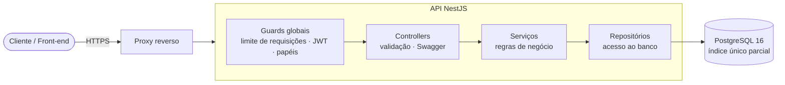

# App de gerenciamento de empréstimo de equipamentos

[](https://github.com/Brunacoelhob/app-gerenciamento-emprestimo-equipamentos/actions/workflows/ci.yml)


API REST para controlar quem está com cada equipamento (notebooks, projetores, ferramentas...): cadastro, retirada, devolução, prazo e atraso. O foco do projeto é **segurança e integridade**: ninguém vira administrador sem permissão, e **um equipamento nunca é emprestado a duas pessoas ao mesmo tempo, nem sob requisições simultâneas**.

## O que ela faz

- **Autenticação** com e-mail e senha: token de acesso curto (15 min) + *refresh token* de uso único, com detecção de roubo. Troca de senha e saída encerram as sessões.
- **Recuperação de senha por e-mail** ("esqueci minha senha"): link de uso único que vale 30 minutos, sem revelar quais e-mails existem. Em desenvolvimento os e-mails vão para um [Mailpit](https://mailpit.axllent.org) local (`docker compose --profile dev up -d mailpit`, caixa de entrada em http://localhost:8025), sem enviar nada de verdade.
- **Avisos por e-mail:** todo dia às 8h a API lembra quem vence em 24h, cobra quem atrasou (no máximo a cada 3 dias) e manda um resumo aos administradores. Cada aviso sai uma vez só, mesmo com mais de uma instância da API. Administradores podem rodar na hora em `POST /v1/notificacoes/executar`.
- **Privacidade (LGPD):** administradores veem CPF e telefone mascarados; cada pessoa pode **baixar os próprios dados** e **excluir a conta** (anonimização que preserva o histórico dos equipamentos). Há também uma **trilha de auditoria** das ações administrativas.
- **Dois papéis:** `USER` retira e devolve equipamentos; `ADMIN` também cadastra equipamentos, vê todos os empréstimos e gerencia usuários.
- **Equipamentos:** cadastro, edição, busca, desativação (só se não estiver emprestado) e situação sempre correta (`emprestado`/`disponivel` são derivados, nunca ficam desatualizados).
- **Empréstimos:** prazo de 1 a 30 dias (padrão 7), devolução pelo dono ou por um ADMIN, **atraso** calculado, e listagens com filtros (status, atrasados, pessoa, equipamento).
- **Renovação e fila de espera:** o prazo pode ser renovado até 2 vezes antes de vencer; quem quer um equipamento emprestado entra na fila e recebe e-mail quando ele for devolvido. O administrador imprime uma **etiqueta com QR code** por equipamento.
- **Fotos** dos equipamentos, **prioridade na fila** (24 horas exclusivas para quem reservou primeiro), **Política de Privacidade** com aceite no cadastro e **monitoramento** (`/metricas`, alerta de queda, backup diário).
- **Relatórios** em PDF, Excel e CSV de auditoria, empréstimos e equipamentos, com os filtros da tela.
- **Listagens paginadas** com metadados (`total`, `totalPaginas`) e ordenação estável.
- **Documentação interativa (Swagger)** em `/docs` fora de produção, e rota de saúde `/saude`.

## Garantia de integridade (o diferencial)

A regra "um equipamento só tem **um** empréstimo ativo" não depende de um `if` no código, que duas requisições simultâneas conseguem burlar. Ela é garantida em **três camadas**:

1. **Trava da linha** (`SELECT ... FOR UPDATE`): pedidos simultâneos pelo mesmo equipamento entram em fila.
2. **Índice único parcial no PostgreSQL** (`WHERE status = 'ATIVO'`): o banco recusa o segundo empréstimo ativo, mesmo que alguém grave direto nele.
3. **Devolução atômica:** a condição "ainda está ATIVO" faz parte do próprio `UPDATE`, então só uma devolução vence.

Há testes de integração que provam isso: **30 retiradas simultâneas do mesmo equipamento resultam em exatamente 1 sucesso e 29 conflitos**, repetido várias vezes, além de devoluções duplas e de retirada contra desativação ao mesmo tempo. Veja a história completa em [docs/seguranca.md](docs/seguranca.md).

## Arquitetura



Cada módulo (`auth`, `usuarios`, `equipamentos`, `emprestimos`) segue **controller → serviço → repositório**: o controller só trata HTTP e validação, o serviço decide as regras, o repositório é a única porta para o banco. Detalhes e decisões em [docs/arquitetura.md](docs/arquitetura.md).

```
backend/             API (NestJS)
frontend/            interface web (Angular)
```

Dentro de `backend/`:

```
src/
├── auth/            login, registro, refresh token, troca de senha
├── usuarios/        gestão de contas (ADMIN)
├── equipamentos/    cadastro, busca, edição, desativação
├── emprestimos/     retirada, devolução, prazo, atraso
├── sessoes/         refresh tokens (guardados só como hash)
├── saude/           GET /saude
├── common/          guards, filtro de erros, paginação, validação
├── config/          leitura e validação do ambiente
└── prisma/          conexão com o banco
prisma/              schema, migrations e seed
test/                testes de integração
```

## Como executar

### Com Docker (mais simples)

```bash
cp .env.example .env
# edite o .env: DB_SENHA, JWT_SECRET, ADMIN_EMAIL e ADMIN_SENHA (veja os comentários do arquivo)
docker compose up -d --build
```

Sobem quatro serviços: o **banco** (não exposto fora do Docker), um serviço **migrar** que aplica as migrations e cria o primeiro administrador (e termina), a **API** em `http://localhost:3000` e a **interface web** em `http://localhost:8080` (nginx servindo o Angular e encaminhando `/api` para a API, então não há CORS no navegador). Confira em `http://localhost:3000/saude` e abra `http://localhost:8080`.

### Local, sem Docker

Pré-requisitos: Node 22.12+ (para rodar os **testes**, Node 24.9+: o Jest só carrega os pacotes ESM do Nest 12 a partir dele) e um PostgreSQL acessível.

```bash
cd backend
cp ../.env.example .env         # preencha DATABASE_URL, JWT_SECRET, ADMIN_EMAIL e ADMIN_SENHA
npm install
npx prisma migrate deploy       # cria as tabelas
npm run seed                    # cria o primeiro administrador a partir do .env
npm run start:dev               # http://localhost:3000  ·  Swagger em /docs
```

### Frontend (Angular)

Com a API rodando em `http://localhost:3000`:

```bash
cd frontend
npm install
npm start                       # http://localhost:4200
```

O servidor de desenvolvimento encaminha `/api/*` para a API (veja `frontend/proxy.conf.json`), então **não é preciso configurar CORS** localmente.

A interface tem: login e sessão (renovação automática do token), **dashboard** com oito indicadores e gráficos (movimentação diária, situação do acervo, rankings e atrasos; o administrador vê o sistema todo e cada pessoa vê os próprios empréstimos), cada card com uma janela explicando o que o número significa e como é calculado, botão **Voltar** nas páginas, equipamentos, empréstimos, **perfil** (foto do acervo de bichinhos ou enviada, dados pessoais com CPF, telefone e CEP com preenchimento do endereço, troca de senha), **gestão de usuários** para administradores (criar contas e perfis) e uma **barra de acessibilidade fixa no topo** de todas as telas, com um botão ao lado do outro: tamanho do texto (A− e A+), alto contraste, modo escuro/claro, fonte para dislexia, cores para daltonismo, redução de animações e [VLibras](https://vlibras.gov.br/) (tradução para Libras) com o ícone no canto direito da tela. O daltonismo tem um menu com os tipos (protanopia, deuteranopia, tritanopia e acromatopsia), cada um com a sua paleta. As escolhas ficam salvas no navegador. A sessão fica num **cookie `HttpOnly`**, que o JavaScript da página não consegue ler.

As imagens do acervo de avatares são do [Twemoji](https://github.com/jdecked/twemoji) (CC-BY 4.0), em `frontend/public/avatares/`.

### Dados de demonstração

Para ver o sistema "vivo" (pessoas, equipamentos, empréstimos devolvidos, em andamento e atrasados), com a API configurada:

```bash
cd backend
npm run seed:fotos  # coloca fotos reais nos equipamentos que ainda não têm
npm run seed:demo   # contas @equipmentloan.com; a senha aleatória aparece uma única vez (ou defina DEMO_SENHA)
```

Pode rodar de novo sem duplicar nada, e se recusa a rodar em produção. Para apagar a demonstração anterior e gerar tudo de novo (≈85 dias de histórico, com atrasos), use `npm run seed:demo -- --refazer`.

> **Não existe senha de administrador padrão.** O `seed` se recusa a rodar sem `ADMIN_EMAIL` e `ADMIN_SENHA` (12+ caracteres, com letras e números) e nunca imprime a senha.

## Configuração

| Variável | Obrigatória | Descrição |
|---|---|---|
| `DATABASE_URL` | sim | Conexão do PostgreSQL |
| `JWT_SECRET` | sim | Chave dos tokens, **mínimo 32 caracteres** (o valor de exemplo é recusado) |
| `JWT_EXPIRA_EM` | não | Duração do token de acesso (padrão `15m`) |
| `REFRESH_DIAS` | não | Validade do refresh token (padrão `7`) |
| `BCRYPT_CUSTO` | não | Custo do bcrypt, 4 a 15 (padrão `12`) |
| `CORS_ORIGENS` | não | Origens de navegador liberadas, separadas por vírgula. **Vazio = nenhuma** |
| `SWAGGER_ATIVO` | não | Padrão: ligado fora de produção, desligado em produção |
| `ADMIN_EMAIL` / `ADMIN_SENHA` | só no seed | Primeiro administrador |
| `DATABASE_URL_TESTE` | só nos testes | Banco exclusivo de testes (o nome precisa conter `test`) |

A aplicação **valida tudo na partida** e falha com uma mensagem clara se algo estiver faltando ou inseguro.

## API

Todas as rotas de negócio ficam em `/v1`. Tudo exige o cabeçalho `Authorization: Bearer <accessToken>`, exceto as rotas públicas indicadas.

| Método | Rota | Quem | Descrição |
|---|---|---|---|
| `POST` | `/v1/auth/registro` | público | Cria uma conta **sempre como USER** (`role` é recusado com 400) |
| `POST` | `/v1/auth/login` | público | Devolve `accessToken` e `refreshToken` |
| `POST` | `/v1/auth/renovar` | público | Troca o refresh token por um par novo (uso único) |
| `POST` | `/v1/auth/sair` | público | Invalida o refresh token |
| `GET` | `/v1/auth/eu` | logado | Dados de quem está logado |
| `PATCH` | `/v1/auth/senha` | logado | Troca a própria senha e encerra as sessões |
| `GET` · `POST` | `/v1/usuarios` | ADMIN | Lista e cria usuários (inclusive outro ADMIN) |
| `GET` · `PATCH` | `/v1/usuarios/:id` | ADMIN | Detalha; muda papel; ativa ou desativa a conta |
| `GET` | `/v1/equipamentos` | logado | Lista (`pagina`, `limite`, `ativo`, `emprestado`, `busca`) |
| `POST` | `/v1/equipamentos` | ADMIN | Cadastra |
| `GET` · `PATCH` | `/v1/equipamentos/:id` | logado · ADMIN | Detalha; edita ou desativa |
| `POST` | `/v1/emprestimos` | logado | Retira um equipamento (`equipamentoId`, `dias`) |
| `PATCH` | `/v1/emprestimos/:id/devolucao` | dono ou ADMIN | Devolve |
| `GET` | `/v1/emprestimos/meus` | logado | Os seus (`status`, `atrasados`) |
| `GET` | `/v1/emprestimos` | ADMIN | Todos (`usuarioId`, `equipamentoId`, `status`, `atrasados`) |
| `PATCH` | `/v1/emprestimos/:id/renovacao` | dono ou ADMIN | Soma `dias` (1 a 14, padrão 7) ao prazo; no máximo 2 vezes, só antes de vencer |
| `GET` | `/v1/emprestimos/relatorio` · `/meus/relatorio` | ADMIN · logado | Relatório (`formato=pdf\|xlsx\|csv`) com os mesmos filtros da listagem |
| `GET` | `/v1/equipamentos/relatorio` | ADMIN | Relatório do acervo |
| `PUT` · `DELETE` | `/v1/equipamentos/:id/foto` | ADMIN | Envia (corpo = a imagem, até 400 KB) ou remove a foto |
| `GET` | `/v1/equipamentos/foto/:codigo` | público | A foto, pelo código aleatório do equipamento |
| `GET` | `/metricas` | token de métricas | Métricas no formato Prometheus (desligada sem `METRICAS_TOKEN`) |
| `POST` | `/v1/reservas` | logado | Entra na fila de um equipamento emprestado (`equipamentoId`) |
| `GET` | `/v1/reservas/minhas` | logado | As suas filas, com a posição em cada uma |
| `DELETE` | `/v1/reservas/:id` | dono ou ADMIN | Sai da fila |
| `GET` | `/saude` | público | API e banco no ar |

### Respostas e erros

Listas voltam como `{ "itens": [...], "meta": { "total", "pagina", "limite", "totalPaginas" } }`. Todo erro segue o mesmo formato, em português:

```json
{
  "statusCode": 409,
  "erro": "Conflito",
  "mensagem": "Este equipamento já está emprestado.",
  "caminho": "/v1/emprestimos",
  "timestamp": "2026-10-01T12:00:00.000Z"
}
```

Em erros de validação (`400`), `mensagem` é uma lista com um texto por campo inválido. Códigos usados: `400` dados inválidos · `401` sem login ou sessão inválida · `403` sem permissão · `404` não encontrado · `409` conflito (já emprestado, já devolvido, e-mail repetido) · `422` senha atual incorreta · `429` muitas requisições.

## Testes

No diretório `backend/`:

```bash
npm test            # 104 testes unitários (regras de negócio, sem banco)
npm run test:e2e    # 124 testes de integração: API inteira + PostgreSQL de teste
npm run lint        # sem erros
```

Os testes de integração sobem a aplicação com **a mesma configuração da produção** e cobrem permissões por papel, o fluxo completo de empréstimos, sessões (rotação e roubo de refresh token, troca de senha, desativação) e **concorrência**. Usam um banco exclusivo: defina `DATABASE_URL_TESTE` (o teste **recusa** qualquer nome de banco sem `test`, para nunca apagar o de desenvolvimento).

No `frontend/`: `npm test` (Vitest) roda os testes do interceptor de autenticação.

O **GitHub Actions** roda tudo a cada envio, com um PostgreSQL real, e ainda constrói as imagens Docker e sobe a stack conferindo `/saude`.

## Documentação

- [docs/progresso.md](docs/progresso.md): checklist do que foi feito, do que falta e do que ainda não foi verificado
- [docs/arquitetura.md](docs/arquitetura.md): camadas, modelo de dados, decisões e como a integridade é garantida
- [docs/seguranca.md](docs/seguranca.md): auditoria, falhas encontradas e corrigidas, controles e riscos aceitos
- [docs/deploy.md](docs/deploy.md): publicação em um servidor com HTTPS, backup e atualização

## Licença

[MIT](LICENSE). Autora: Bruna Coelho.
