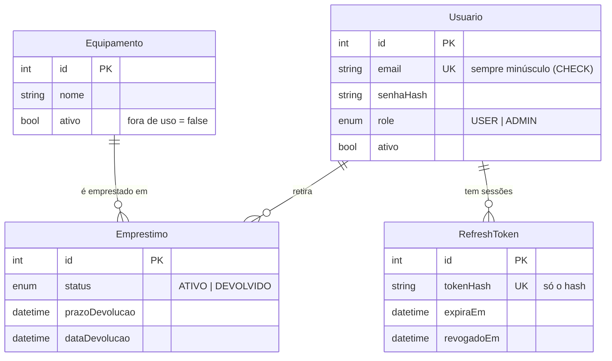

# Arquitetura

## Visão geral

API monolítica modular em **NestJS** sobre **PostgreSQL** (via Prisma 7 com driver adapter). Cada área do negócio é um módulo independente com três camadas bem separadas:

| Camada | Responsabilidade | Não faz |
|---|---|---|
| **Controller** | Receber HTTP, validar a entrada (DTOs), documentar (Swagger), aplicar papéis | Regra de negócio, acesso ao banco |
| **Serviço** | Decidir as regras (quem pode, o que é permitido, qual erro devolver) | Falar SQL, conhecer HTTP além das exceções |
| **Repositório** | Única porta para o banco; traduz erros do Prisma em resultados simples | Decidir regras de negócio |

Por que separar assim: as regras ficam **testáveis sem banco** (serviços com repositórios simulados: 39 testes unitários rápidos) e o banco fica testável **sem HTTP**. Trocar o Prisma por outra tecnologia mexeria só nos repositórios.

```
Requisição
   │
   ▼
Guards globais (nesta ordem):  limite de requisições → JWT → papéis
   │
   ▼
Pipe de validação  (campo desconhecido = 400, tipos convertidos)
   │
   ▼
Controller → Serviço → Repositório → PostgreSQL
   │
   ▼
Filtro de exceções  (um único formato de erro, em português, sem vazar detalhes internos)
```

## Módulos

| Módulo | O que contém |
|---|---|
| `auth` | Registro público, login, renovação, saída, troca de senha; estratégia JWT |
| `usuarios` | Gestão de contas por ADMIN; regras de proteção do último administrador |
| `sessoes` | Repositório de *refresh tokens* (módulo próprio para `auth` e `usuarios` o compartilharem sem dependência circular) |
| `equipamentos` | CRUD, busca, filtros, desativação protegida contra corrida |
| `emprestimos` | Retirada e devolução atômicas, prazo, atraso, listagens |
| `saude` | `GET /saude`: API + `SELECT 1` no banco |
| `common` | Guards, decoradores, filtro de erros, log de requisições, paginação, política de senha |
| `config` | Leitura **e validação** do ambiente na partida |

## Modelo de dados



Pontos de design:

- **`emprestado` não é coluna.** É derivado da existência de um empréstimo `ATIVO`. Uma flag duplicada pode divergir do histórico (a versão original tinha esse risco); com uma só fonte da verdade isso é impossível.
- **Índice único parcial** `Emprestimo(equipamentoId) WHERE status = 'ATIVO'`: vive em SQL na migration porque o Prisma não representa índices parciais. É a garantia final de integridade.
- **`CHECK (email = lower(email))`:** o banco também recusa e-mail com maiúsculas, caso alguém grave sem passar pela API.
- **Refresh token só como hash:** quem ler o banco não consegue usar nenhum token.

## Como a integridade é garantida

O problema clássico é o *check-then-act*: "o equipamento está livre? sim → então crio o empréstimo". Duas requisições simultâneas passam pela checagem **antes** de qualquer uma gravar, e ambas criam o empréstimo. Na auditoria original, 30 retiradas simultâneas do mesmo item resultaram em **19 sucessos**.

A solução combina:

1. **Pessimista (aplicação):** na transação da retirada, a linha do equipamento é travada com `SELECT ... FOR UPDATE`. Quem chega depois espera e então enxerga o resultado do primeiro.
2. **Banco (última barreira):** o índice único parcial recusa o segundo `ATIVO`. O repositório converte essa violação (`P2002`) em "indisponível" (409), em vez de um erro 500.
3. **Devolução:** `UPDATE ... WHERE id = ? AND status = 'ATIVO'` e conferir quantas linhas mudaram. Só uma devolução vence.
4. **Desativar equipamento:** usa a mesma trava e confere se há empréstimo ativo na mesma transação. Ou o empréstimo entra primeiro (a desativação é recusada), ou a desativação entra primeiro (a retirada é recusada). Nunca sobra equipamento desativado e emprestado.

Os testes `FALHAS CORRIGIDAS 2 e 3` em `test/api.e2e-spec.ts` reproduzem esses cenários.

## Decisões e alternativas descartadas

| Decisão | Por quê | Alternativa descartada |
|---|---|---|
| Papel e situação da conta lidos do banco a cada requisição | Desativar uma conta ou mudar um papel vale **na hora**, mesmo com token válido | Papel dentro do JWT: fica desatualizado até o token expirar. Custo da decisão: 1 consulta por requisição (barata, por chave primária) |
| Access token curto + refresh token rotativo | Token roubado vale poucos minutos; reuso de refresh token denuncia roubo | Token único de 1 dia: janela grande para um token vazado |
| Rotas em português, versionadas (`/v1`) | Mesmo idioma do domínio; permite evoluir sem quebrar clientes | Rotas em inglês misturadas com domínio em português |
| Retirada pessimista (trava) + índice | Falha rápida e clara (409); o índice cobre qualquer caminho que a trava não cubra | Só `SERIALIZABLE` + repetição: mais código de repetição e erros de serialização para o cliente |
| Migrations em serviço separado no Docker | A imagem da API não precisa do CLI do Prisma em execução | Rodar `migrate deploy` ao iniciar a API: várias réplicas disputariam a migration |
| Prisma 7 com *driver adapter* | Sem binário de motor; conexão via `pg` | — |

## Evolução natural

- **Escala horizontal:** a API é *stateless* (sessões no banco), então várias réplicas funcionam; o limite de requisições (`@nestjs/throttler`) é em memória e, com réplicas, deveria usar um armazenamento compartilhado (Redis).
- **Auditoria:** uma tabela de eventos (quem retirou, devolveu, mudou papel) para rastreabilidade.
- **Notificações:** aviso de atraso por e-mail.
